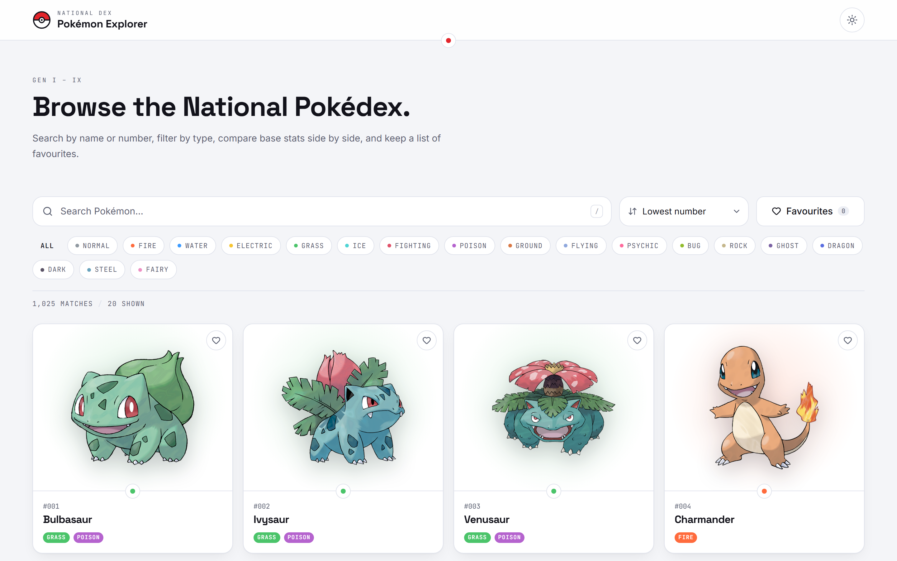
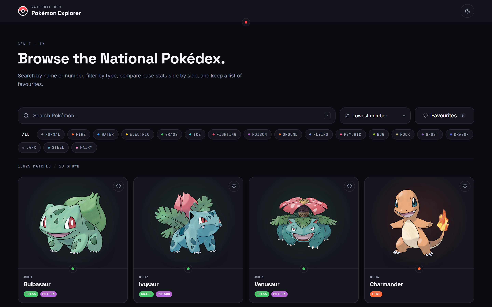
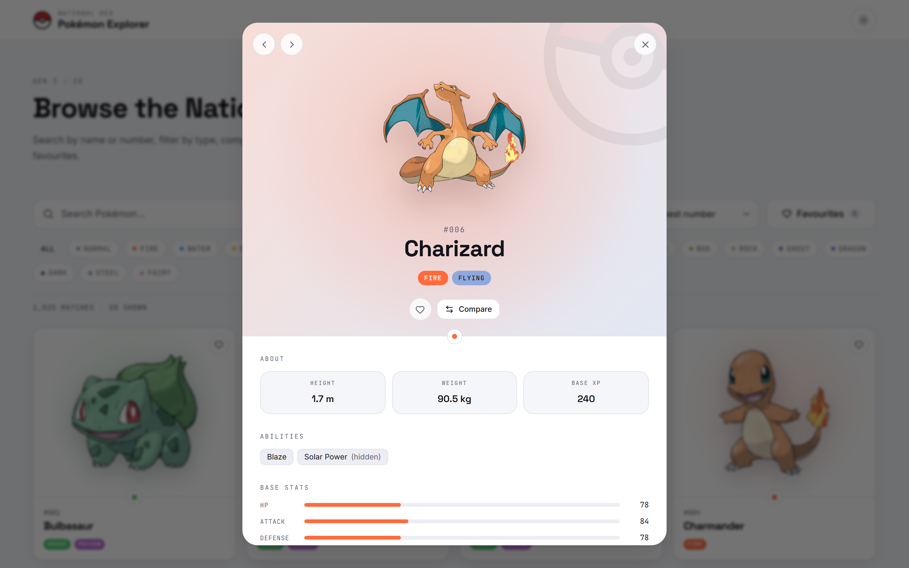
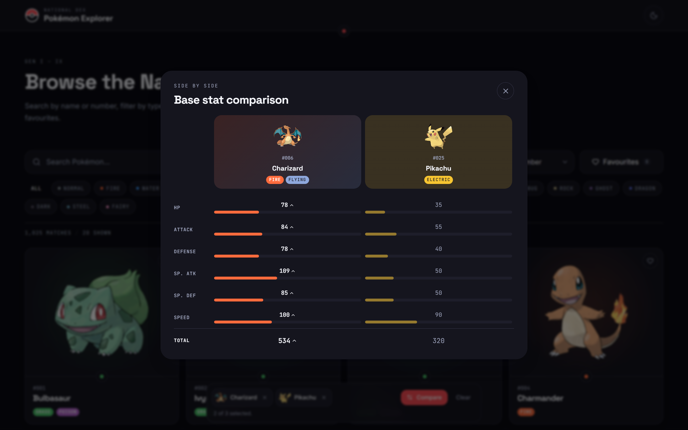
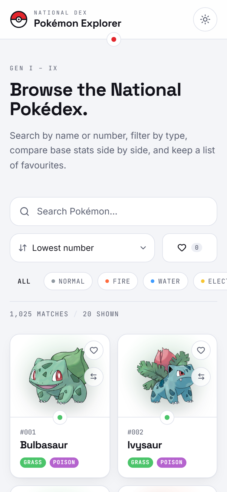

# Pokémon Explorer

A catalogue instrument for the first 1025 Pokémon, built on the public [PokéAPI](https://pokeapi.co/).
Search, filter, sort, favourite, and compare — with every view worth sharing addressable by URL.

**Live demo:** _add your deployment URL here_ · **Repository:** https://github.com/LakraAnshul/PipelineAI-Pokemon



<table>
  <tr>
    <td></td>
    <td></td>
  </tr>
  <tr>
    <td></td>
    <td></td>
  </tr>
</table>

**More screens:** [type filter](screenshots/type-filter.png) ·
[no results](screenshots/search-empty-state.png) ·
[API unreachable](screenshots/error-state.png) ·
[loading skeletons](screenshots/loading-skeletons.png) ·
[tablet](screenshots/home-tablet.png) ·
[detail sheet on mobile](screenshots/detail-mobile-sheet.png)

---

## Features

### Core

- **Card grid** — official artwork, name, dex number set in mono, and type badges, over a wash drawn from the Pokémon's own primary type. 2 columns on a phone → 3 → 4 → 5 on a wide desktop.
- **Search by name** — debounced 250 ms and matched against the full name index the app fetches once, because PokéAPI has no search endpoint. A miss says `Pokémon not found.` rather than showing an empty grid.
- **Load More** — pages 20 at a time and reports `n of m loaded`, so the length of the list is never a surprise.
- **Detail view** — a dialog with large artwork, dex number, types, height, weight, abilities, all six base stats as meters, and moves. Arrow keys walk the filtered list without closing it.
- **Filter by type** — all 18 types as a single-select radio group; the count readout updates with the filter.
- **Responsive** — one layout from 320 px to ultrawide, with the detail view switching from a bottom sheet to a centred dialog at `sm`. No horizontal scroll at any width.
- **Skeleton loading** — shimmer placeholders shaped like the cards they replace, keyed by dex number so an arriving card takes its own slot. The word "Loading…" never appears alone.
- **Error handling** — failures are classified as network, HTTP, not-found, or malformed, and each gets its own sentence plus a `Try Again` button. Requests time out after 12 s; a dropped connection or a 5xx is retried once, a 404 never is.
- **Empty state** — names what was searched, and offers the way back out.

### Bonus

- **Favourites** — persisted to `localStorage`, kept in sync across tabs, with a favourites-only view at `/?favorites=1`.
- **Dark mode** — follows the system until you override it; the override is what gets remembered, not the resolved colour.
- **Sorting** — by dex number, name, HP, attack, or speed. Full-dex stat sorts are honest about their scope (see *Challenges*).
- **Compare** — pick two Pokémon and read their base stats as a real table, with the higher value in each row marked by weight, colour, and a caret. Ties are reported as ties.
- **Keyboard accessibility** — every control reachable by `Tab`, `Enter`/`Space` to activate, `Escape` to close. Dialogs trap focus and hand it back to whatever opened them. `src/test/a11y.test.tsx` walks the whole page by keyboard and asserts the order.
- **URL-addressable everything** — `/pokemon/pikachu` deep-links straight to a Pokémon, and the search, type, sort, and favourites filters all live in the query string. The back button and a pasted link both behave.

Beyond the brief: a live count readout, `prefers-reduced-motion` respected throughout, an offline banner that explains itself and retries when the connection returns, image fallbacks two deep before anything could render a broken image, and an error boundary above the routes.

## Tech Stack

| Layer | Choice | Why |
|---|---|---|
| Framework | **React 19** + **TypeScript** (strict, no `any`) | The brief's preferred stack. |
| Build | **Vite 8** | Instant dev server; the production bundle is ~132 kB gzipped. |
| Routing | **React Router 7** | The URL is the single source of truth for search, type, sort, favourites, and the open Pokémon. |
| Styling | **Tailwind CSS v4** | CSS-first `@theme` tokens, so the design system is one file of custom properties. |
| Animation | **Framer Motion 13** | Shared-layout dialog transitions, with `reducedMotion="user"` honoured globally. |
| Icons | **Lucide React** | As the brief suggests. |
| Type | Space Grotesk · Inter · JetBrains Mono | Self-hosted via Fontsource — no external requests, no layout shift. |
| Testing | **Vitest** + React Testing Library | 137 tests across 18 files, including a full keyboard journey. |
| Linting | **oxlint** + Prettier | Same rule families as ESLint's `react`/`jsx-a11y` plugins, ~50× faster. |

No state library, no data-fetching library. Loading, error, and empty handling are explicitly graded, so they stay hand-rolled and visible in `src/services/pokemonApi.ts` and `src/hooks/`.

## API Used

[**PokéAPI v2**](https://pokeapi.co/docs/v2) — public, free, no key and no auth headers.

| Endpoint | Used for |
|---|---|
| `GET /pokemon?limit=&offset=` | The name index, fetched once and cached. |
| `GET /pokemon/{name or id}` | Everything a card and the detail view show. |
| `GET /type/{type}` | The member list for a type filter. |

Official artwork is derived from the dex number rather than requested separately:

```
https://raw.githubusercontent.com/PokeAPI/sprites/master/sprites/pokemon/other/official-artwork/{id}.png
```

IDs at or above 10000 are alternate forms with no official artwork, so the roster stops at the canonical National Dex — derived from the ID, never hard-coded to a species count.

Please be considerate with PokéAPI's free infrastructure: responses are cached in memory per session, in-flight requests are shared between callers, and detail fetches are pooled at 12 concurrent requests.

## Installation

Requires **Node.js ≥ 20** and npm ≥ 10.

```bash
git clone https://github.com/LakraAnshul/PipelineAI-Pokemon.git
cd PipelineAI-Pokemon
npm ci
```

No environment variables are needed — PokéAPI is public. `.env.example` documents the one optional override (a proxy or mirror base URL) if you ever need it.

## Running Locally

```bash
npm run dev        # dev server on http://localhost:5173
npm run build      # typecheck, then a production build into dist/
npm run preview    # serve the production build locally
npm test           # run the test suite once
npm run test:watch # watch mode
npm run lint       # oxlint
npm run typecheck  # tsc, no emit
npm run verify     # typecheck + lint + test + build, in that order
```

### Deployment

The build output is a static SPA in `dist/`. Both configs below are already in the repo, and both exist for one reason: a static host must rewrite unknown paths to `index.html`, or a deep link like `/pokemon/pikachu` returns a 404 instead of opening Pikachu.

**Vercel** — import the repository; the framework preset is detected as Vite. Build command `npm run build`, output directory `dist`. `vercel.json` supplies the rewrite.

**Render** — New → Static Site, or point Render at `render.yaml` as a Blueprint. Build command `npm ci && npm run build`, publish directory `dist`.

## Project Structure

```
src/
├── components/
│   ├── compare/      CompareTray, CompareModal — the side-by-side stat table
│   ├── controls/     SearchBar, TypeFilter, SortSelect, Toolbar
│   ├── layout/       Header, Footer, Container, SkipLink, ThemeToggle, FavoritesLink
│   ├── pokemon/      PokemonCard, PokemonGrid, PokemonArtwork, PokemonDetailModal, MoveList, LoadMore
│   ├── states/       GridSkeleton, EmptyState, ErrorState, OfflineBanner, ErrorBoundary
│   └── ui/           Button, Modal, TypeBadge, StatBar, IconToggle, Seam, PokeBallMark, PokeBallLoader
├── contexts/         ThemeContext, FavoritesContext, CompareContext — cross-cutting state, persisted
├── hooks/            usePokemonRoster, usePokemonDetail, useRosterParams, useDebounce,
│                     useLocalStorage, useFocusTrap, useLockBodyScroll, useOnlineStatus
├── pages/            HomePage, NotFoundPage
├── services/         pokemonApi.ts — the only module that touches the network
├── styles/           index.css — design tokens as @theme custom properties
├── test/             setup.ts, fixtures.ts, a11y.test.tsx
├── types/            pokemon.ts — the normalised domain shapes
└── utils/            formatters, typeColors, sortPokemon, cn
```

Tests sit next to what they test (`PokemonCard.tsx` / `PokemonCard.test.tsx`); only the cross-cutting keyboard journey lives in `src/test/`.

The dependency direction is one-way: `services` knows nothing about React, `hooks` know nothing about markup, and components receive data as props. That is what keeps `PokemonCard` reusable and the API layer testable without a DOM.

## Challenges Faced

**The list endpoint returns names and URLs, nothing else.** `GET /pokemon` gives `{name, url}` per entry, but a card needs types, artwork, and stats — one request per Pokémon. Fetching 20 cards serially is slow and fetching all 1025 at once is abusive. The service pools detail requests at 12 concurrent and caches the *promise* rather than the result, so a card, the detail dialog, and the compare tray asking for Pikachu at the same moment share one request. Batches resolve with `Promise.allSettled`, so one dead entry drops out instead of failing the whole page.

**PokéAPI cannot sort by stat.** There is no `?sort=attack`, and sorting the full dex by attack would mean fetching 1025 detail payloads before rendering anything. So the scope is stated rather than hidden: a filtered set is loaded completely and sorts completely, and an unfiltered stat sort eagerly loads up to 400 Pokémon and says *"Sorting applies to the Pokémon loaded so far."* Sorting by dex number or name needs no detail data at all and always covers everything.

**Type filtering is a different endpoint with a different shape.** `/type/{type}` returns its whole member list at once, with no pagination — the opposite of `/pokemon`. So the roster hook treats the two as one interface: fetch the reference list (paginated or not), narrow it by search and favourites, then page *that* client-side. `Load More` behaves identically either way, and switching filters never leaves stale cards on screen.

**Keeping four filters and a modal in the URL without wrecking the back button.** Search, type, sort, favourites, and the open Pokémon all live in the URL, which is what makes a filtered view shareable. Naively, every keystroke becomes a history entry and the back button crawls through them one character at a time. So filter changes `replace` the current entry while opening a Pokémon `push`es a new one — the back button steps out of a Pokémon, never through a half-typed query. Defaults are omitted from the query string entirely, so a clean view has a clean URL.

**Alternate forms have no artwork.** The list endpoint's `count` of ~1302 includes IDs at or above 10000 — mega evolutions, regional variants, costumed Pikachus — and the official-artwork repository has no file for them, so they render as broken images. They are filtered out by an ID floor derived from the data rather than a hard-coded species total, so the roster stays correct when the next generation ships.

**Also worth naming:** jsdom reports `offsetParent` as `null` for every element, so the focus trap's visibility filter cannot be exercised there — Tab cycling inside a dialog is verified in a real browser, and the test suite asserts the parts jsdom can see (focus moves in, focus comes back, Escape closes). And the one lint rule switched off, `jsx-a11y/prefer-tag-over-role`, is off after checking all ten elements it flagged: `<meter>` and `<progress>` draw UA internals that cannot be restyled into these stat bars, `<dialog>` lives in the top layer with a focus and backdrop lifecycle that fights the animation and focus trap already here, `<output>` means "result of a calculation" and is form-associated, which a loading skeleton is not, and `role="img"` on a span wrapping an inline SVG exists precisely because there is no image to fetch. Every one of them still carries the correct role and accessible name, asserted from the outside in `src/test/a11y.test.tsx`.

## Future Improvements

- **Evolution chains** — `/evolution-chain` is a graph, not a list, and deserves a real diagram in the detail view rather than a row of thumbnails.
- **Generation filter** — `/generation/{id}` alongside the type filter, which the roster hook's reference-list interface already accommodates.
- **Virtualised grid** — the DOM cost of 1025 cards is fine today because `Load More` bounds it; a "show all" affordance would need windowing first.
- **Service-worker offline cache** — the offline banner currently explains the problem. With PokéAPI responses in a Cache Storage bucket it could stop being one, since dex data essentially never changes.
- **Playwright E2E** — to cover what jsdom structurally cannot: real focus order in a dialog, actual scroll locking, and the responsive breakpoints at true viewport sizes.
- **Internationalisation** — PokéAPI ships localised species names and flavour text in nine languages; the UI copy would need extracting first.

---

Built by [Anshul Lakra](https://github.com/LakraAnshul). Pokémon data courtesy of [PokéAPI](https://pokeapi.co/); Pokémon and Pokémon character names are trademarks of Nintendo.
